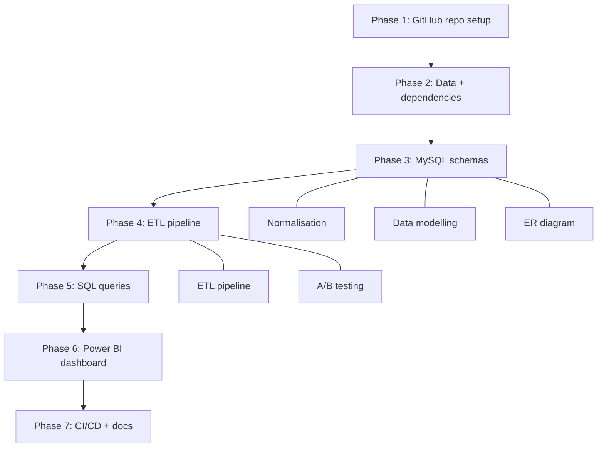

# E-Commerce Analytics Platform

*End-to-end analytics pipeline built on the Olist Brazilian E-Commerce dataset — from raw CSV ingestion through a normalised MySQL database and star schema to an interactive Power BI executive dashboard.*

## Problem Statement

> Olist, a Brazilian e-commerce marketplace, generates transactional data across orders, customers, products, and marketing channels — but without a unified analytics system, this data sits in disconnected CSV exports with no visibility into business performance. This project transforms that raw data into a production-grade analytics platform: a normalised MySQL pipeline, six complex SQL analyses, and a five-page Power BI dashboard tracking $13.17M in revenue, funnel drop-offs, marketing ROAS, customer LTV cohorts, and A/B test significance — all version-controlled with CI/CD via GitHub Actions.

---

## Architecture

## Key Results

| Metric                         | Value                          |
|--------------------------------|--------------------------------|
| Total Revenue                  | $13.17M                        |
| Total Orders                   | 95K                            |
| Average Order Value            | $138.13                        |
| Funnel Conversion (end-to-end) | 71.4% (visit to purchase)              |
| Biggest Drop-off Stage         | Checkout — 11.56%              |
| Best ROAS Channel              | Organic Search — $61.81 revenue per $1 spent  |
| Worst ROAS Channel             | Paid Search — $1.97–$2.85 revenue per $1 spent |
| VIP Customer Lifetime Value    | Repeat buyers spend $304.37 on average vs $129.81 for first-time buyers |
| A/B Test Lift                  | New homepage design increased purchase rate from 11.71% to 15.36% (+31%) |
| A/B Statistical Significance   | Result is statistically significant at 95% confidence (z = 9.24 > 1.96) |

---

## What I Built

✦ **ETL Pipeline** — Python scripts ingesting 9 CSVs into a 3-layer MySQL architecture (staging → 3NF core → star schema), with idempotent load logic and FK-safe re-runs.

✦ **Data Modelling** — 8-table 3NF operational schema (ecom_core) + 8-table star schema (3 facts, 5 dims) optimised for Power BI Import.

✦ **Normalisation** — Eliminated transitive dependencies across customers, campaigns, categories, and order_items; FK constraints enforced at the DB level.

✦ **Complex SQL** — 6 analytical queries tackling real business questions: where customers drop off in the purchase journey (LAG window function), which marketing channels deliver the best return per dollar spent (4-table JOIN with date-range attribution), how customer value evolves over time by acquisition cohort (running SUM OVER PARTITION), whether a homepage redesign actually improved conversions (z-test in pure SQL), which product categories drive the most revenue across nested hierarchies (recursive CTE), and which customers are at risk of churning vs which are champions (NTILE quartile scoring for RFM segmentation).

✦ **A/B Testing** — Deterministic variant assignment via MD5 hash; z-test measuring 3.65 percentage point CVR lift at 95% confidence (z = 9.24), computed in both SQL and DAX; visualised in Power BI with gauge + significance badge.

✦ **CI/CD Pipeline** — GitHub Actions: SQL linting (sqlfluff) + pytest on every push.
---

## Tech Stack

`MySQL 8.0` · `Python (pandas, SQLAlchemy, pymysql)` · `Power BI Desktop` · `GitHub Actions` · `Flyway` · `sqlfluff`
